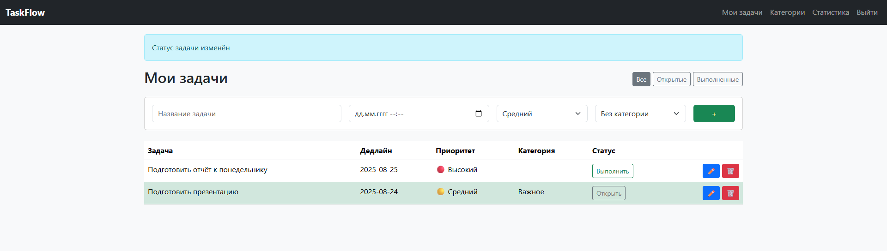
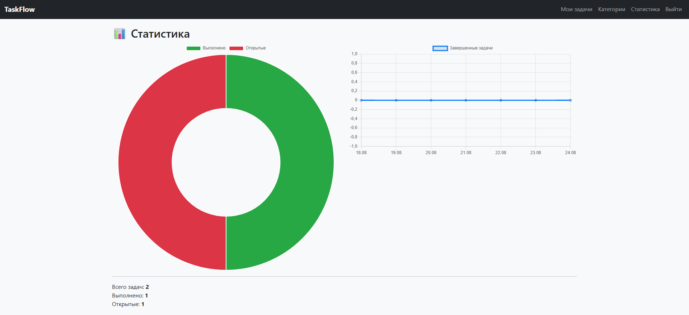

# TaskFlow — менеджер задач.
С его помощью можно:
- создавать и редактировать задачи,
- назначать дедлайны и приоритеты,
- группировать задачи по категориям,
- отслеживать прогресс и статистику выполнения (графики на Chart.js).

## Установка и запуск

### 1. Клонировать репозиторий:
```
git clone https://github.com/AlinaTolchenitsyna/TaskFlow
cd TaskFlow
```

### 2. Установить Docker, если еще не установлен (https://www.docker.com)

### 3. Собрать образ:
```
docker build -t taskflow .
```

### 4. Запустить контейнер:
```
docker run -p 5000:5000 taskflow
```

### 5. Открыть в браузере http://localhost:5000

### 6. Для остановки:
```
docker ps
docker stop <CONTAINER_ID>
```

## Скриншоты
### Список задач


### Статистика

